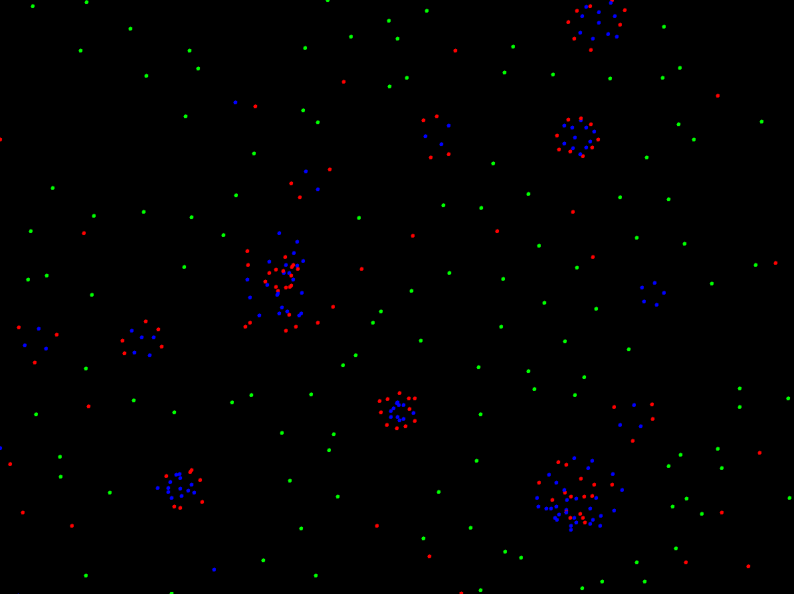

# Particle Life

### What will the application do?

This project is a simulation of **Particle Life**, a game/idea that has been popularized by
*[CodeParade](https://www.youtube.com/watch?v=Z_zmZ23grXE)*, *[Tom Mohr](https://www.youtube.com/watch?v=p4YirERTVF0)*,
and many others. The idea is that simple interactions between particles (attraction and repulsion) defined by a
certain set of rules produces interesting *lifelike* behaviour.

In this simulation, there are different types of particles, distinguished by their *colour*. A particle `a`
exerts a force on particle `b` through a force function `F(d, C)`. It depends on two variables:

 - How close they are to each other, `d`
 - A constant `-1.0 <= C <= 1.0`, dependent on the two particles' types
   - If `C > 0`, the force is attractive
   - If `C < 0`, the force is repulsive

Certain parameters such as the attraction/repulsion constants can be adjusted by the user.

At the start of the simulation, the screen will be filled with a bunch of particles (e.g. 1000). Every frame, each
particle's acceleration is updated according to the force exerted by the particles in its vicinity. The particles will
quickly begin to interact due to the attraction/repulsion rules that we've defined, generally forming clumps
of particles that may look and behave like primitive lifeforms.

### Who will use it?

Anyone with an interest in watching cool simulations! The application is primarily meant to
demonstrate how life can arise from very simple models.

